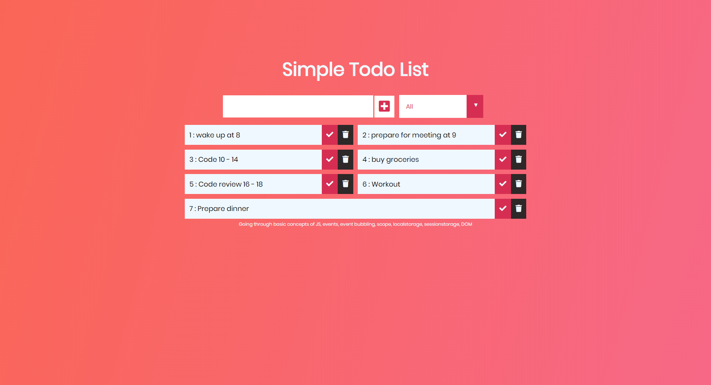

# Simple Todo-List

> A todolist to add and delete a task.
> Filter Options - All,Completed,UnCompleted
> LocalStorage addition

| Skills  |
| ------- |
| - HTML5 | - CSS3 | -JavaScript |

**TodoList Overview**

Live: https://m90khan.github.io/Todo-List-JS-Concepts/


---

## Create the Task

```javascript
function addtodo() {
  //prevent form from submission
  event.preventDefault();
  // Div with li, button check and remove
  const todoDiv = document.createElement("div");
  todoDiv.classList.add("todo");
  //create li
  const newTodo = document.createElement("li");
  newTodo.classList.add("todo-item");
  newTodo.innerText = `${listItems.length + 1} : ${todoInput.value}`;
  todoDiv.appendChild(newTodo);
  // add newtodo in localstorage
  saveLocal(todoInput.value);
  //complete button
  const checkButton = document.createElement("button");
  checkButton.innerHTML = ' <i class="fas fa-check"></i>';
  checkButton.classList.add("complete-btn");
  todoDiv.appendChild(checkButton);
  //delte button
  const deleteButton = document.createElement("button");
  deleteButton.innerHTML = ' <i class="fas fa-trash"></i>';
  deleteButton.classList.add("delete-btn");
  todoDiv.appendChild(deleteButton);

  //appending div to the list
  todoList.appendChild(todoDiv);
  //empty the input field
  todoInput.value = "";
}
```

---



---

## Contact

Reach out to me at one of the following places!

- Website : <a href="https://thewebsitekitchen.com" target="_blank">`thewebsitekitchen.com`</a>
- Linkedin at <a href="https://de.linkedin.com/in/khanmohsinx" target="_blank">`@khanmohsinx`</a>

---
